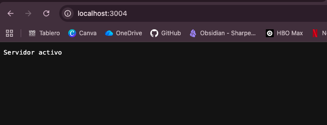
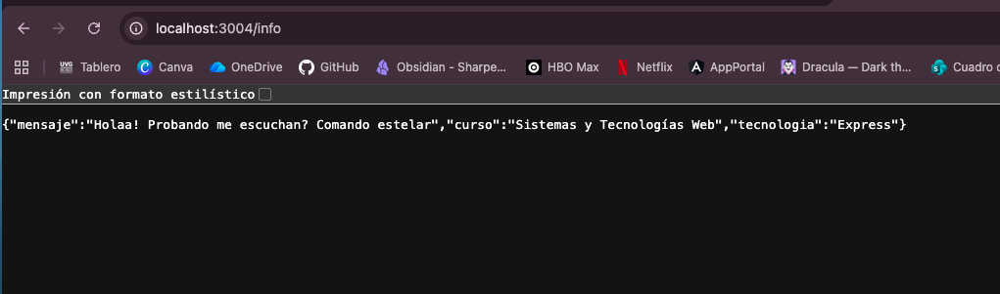
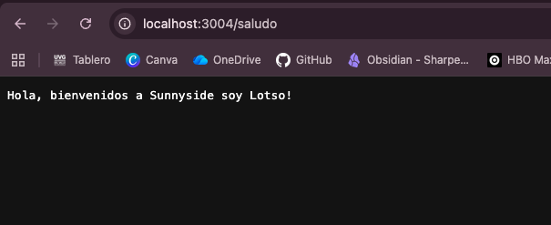
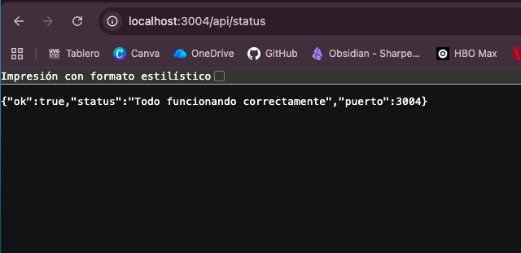
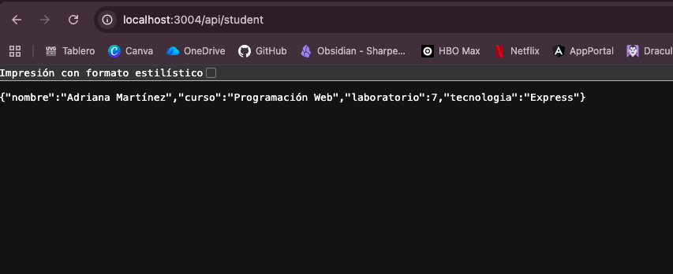
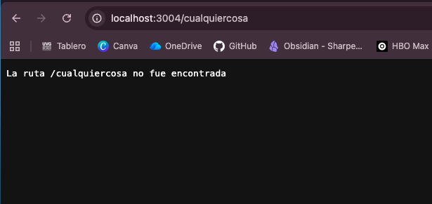

# Laboratorio 7
# Parte 1: Servidor con Express

## Descripción

En esta parte del laboratorio se tomó como base el servidor trabajado en el Laboratorio 6, pero ahora se adaptó para utilizar **Express** en lugar del módulo nativo `http` de Node.js.

---

## Diferencia entre usar `http` y usar `Express`

Con el módulo `http`, el servidor se maneja de forma más manual. Por ejemplo, se debe revisar la ruta con `req.url`, escribir los encabezados con `res.writeHead()` y finalizar la respuesta con `res.end()`. Esto funciona, pero cuando hay varias rutas, el código puede volverse repetitivo y menos fácil de leer.

Con **Express**, el manejo de rutas es más directo. Se pueden definir rutas usando `app.get()`, y las respuestas se envían fácilmente con `res.send()` o `res.json()`. Esto ayuda a que el código sea más claro, más corto y más ordenado.

En resumen, `http` da más control manual, pero Express facilita el desarrollo del servidor y permite trabajar las rutas de una forma más sencilla.

---

## Estructura del proyecto

```txt
PARTE1-EXPRESS/
├── IMG/
│   ├── active-server.png
│   ├── api-status.png
│   ├── api-student.png
│   ├── cualquiercosa.png
│   ├── info.png
│   └── saludo.png
├── node_modules/
├── datos.json
├── package-lock.json
├── package.json
├── servidor-express.js
└── README.md
```

---

## Archivo principal

El archivo principal del servidor es:

```txt
servidor-express.js
```

En este archivo se configuró Express, se definió el puerto `3004` y se crearon las rutas necesarias para probar el funcionamiento del servidor.

---

## Rutas implementadas

Las rutas que se probaron fueron:

```txt
http://localhost:3004/
http://localhost:3004/info
http://localhost:3004/saludo
http://localhost:3004/api/status
http://localhost:3004/api/student
http://localhost:3004/cualquiercosa
```

---

## Ruta principal `/`

Esta ruta sirve para comprobar que el servidor está activo.

Devuelve un mensaje simple indicando que el servidor está funcionando correctamente.



---

## Ruta `/info`

Esta ruta devuelve información general en formato JSON.

Incluye un mensaje, el nombre del curso y la tecnología utilizada, que en este caso es **Express**.



---

## Ruta `/saludo`

Esta ruta devuelve un mensaje de texto simple.

Se agregó como una ruta adicional para comprobar que el servidor puede responder diferentes solicitudes.



---

## Ruta `/api/status`

Esta ruta devuelve un JSON indicando que el servidor está funcionando correctamente.

También muestra el puerto en el que está corriendo el servidor.



---

## Ruta `/api/student`

Esta ruta lee la información del archivo `datos.json` y la devuelve como respuesta en formato JSON.

Esto permite comprobar que el servidor puede leer un archivo local y responder con esos datos usando Express.



---

## Ruta no encontrada

También se agregó un manejo para rutas que no existen.

Cuando el usuario entra a una ruta no definida, el servidor responde con un código `404` y muestra cuál fue la ruta que no se encontró.



---

## Ejecución del servidor

Para ejecutar el servidor se usa el siguiente comando:

```bash
node servidor-express.js
```

Después de ejecutarlo, el servidor queda disponible en:

```txt
http://localhost:3004
```
